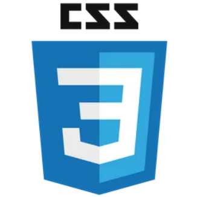
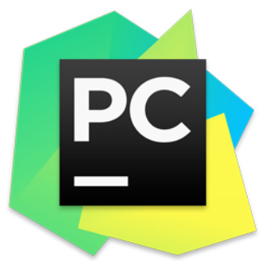
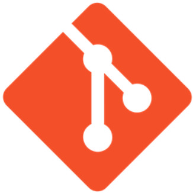
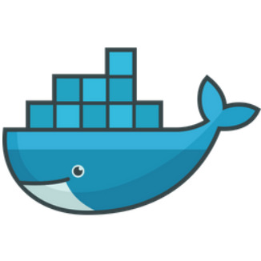
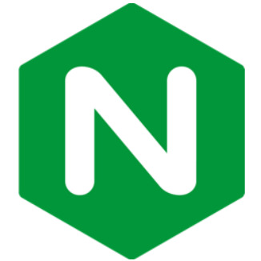
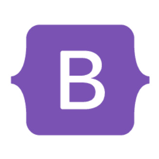

    

## 🛠️ Linguagens 🛠️

    
    
    
    
     
    
    
    
    

---

## 💻 IDEs/Editores 💻

    
    
    

---

## 🗣️ Formas de entrar em contato comigo 🗣️

    
    

---

## 💻 Ferramentas do meu dia a dia 💻

    
    
    
    
    
     
    
    
    
    
    

---

## 🧩 Frameworks 🧩

    
    
    

---

## 💾 Banco de dados 💾

    
    

---

## ☁️ Hospedagem ☁️

    
    
    
    
    

---

## 📄 Meu Currículo 📄

    <a href="docs/Currículo-Lucas-Kawatoko-dev-junior.pdf" download>
        <button style="background-color: #03cffc; border: none; color: white; padding: 10px 20px; text-align: center; text-decoration: none; display: inline-block; font-size: 16px; margin: 4px 2px; cursor: pointer; border-radius: 5px;">
            📥 Baixar Currículo
        </button>
    </a>

---

## 📊 Estatísticas do GitHub 📊

 
 
 

### **Contador de Visitas**

   

