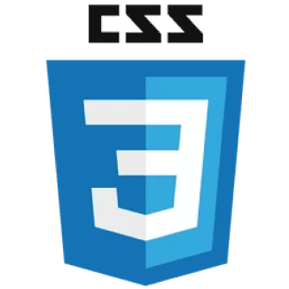

  

 

  
  

  
  
  

---

## Atividade

  

---

## Tech Stack

| Categoria | Ferramentas |
| :--- | :--- |
| **Linguagens** |         |
| **Frameworks** |    |
| **IDEs & Editores** |    |
| **Banco de dados** |   |
| **Hospedagem** |      |
| **Ferramentas** |          |

---

## Contato

  
  

---

## Currículo

  

---

  Lucas Kawatoko · São Paulo, Brasil

---

## Gostou do GIF?

  
  
Basta clicar aqui! Crie o seu no repositório <a href="https://github.com/lucaskawatoko/git-maker">git-maker</a> — cobrinha ou breakout (repos, commits ou seguidores), tudo personalizável em hex.

