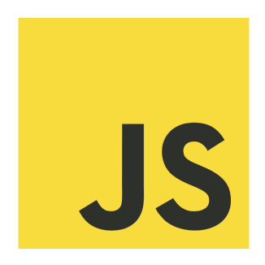
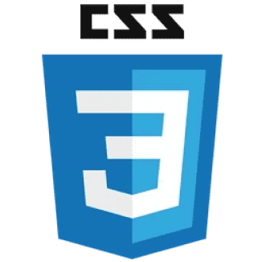
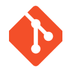
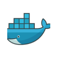
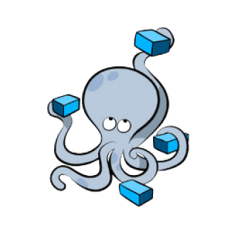

  

---

## Atividade

  

---

## Tech Stack

### 💻 Linguagens

<table>
  <tr>
    <td align="center" width="96"> Python</td>
    <td align="center" width="96"> JavaScript</td>
    <td align="center" width="96"> TypeScript</td>
    <td align="center" width="96"> HTML</td>
  </tr>
  <tr>
    <td align="center" width="96"> CSS</td>
    <td align="center" width="96"> Sass</td>
    <td align="center" width="96"> YAML</td>
    <td align="center" width="96"> Markdown</td>
  </tr>
</table>

### 🧩 Frameworks

<table>
  <tr>
    <td align="center" width="96"> Django</td>
    <td align="center" width="96"> Bootstrap</td>
    <td align="center" width="96"> Tailwind</td>
  </tr>
</table>

### ✏️ Editores

<table>
  <tr>
    <td align="center" width="96"> VS Code</td>
    <td align="center" width="96"> PyCharm</td>
    <td align="center" width="96"> Jupyter</td>
  </tr>
</table>

### 🗄️ Banco de dados

<table>
  <tr>
    <td align="center" width="96"> PostgreSQL</td>
    <td align="center" width="96"> SQLite</td>
  </tr>
</table>

### ☁️ Hospedagem

<table>
  <tr>
    <td align="center" width="96"> GitHub Pages</td>
    <td align="center" width="96"> Netlify</td>
    <td align="center" width="96"> Heroku</td>
    <td align="center" width="96"> Hostinger</td>
    <td align="center" width="96"> HostGator</td>
  </tr>
</table>

### 🛠️ Ferramentas

<table>
  <tr>
    <td align="center" width="96"> Git</td>
    <td align="center" width="96"> GitHub</td>
    <td align="center" width="96"> Actions</td>
    <td align="center" width="96"> Docker</td>
    <td align="center" width="96"> Compose</td>
  </tr>
  <tr>
    <td align="center" width="96"> Linux</td>
    <td align="center" width="96"> Ubuntu</td>
    <td align="center" width="96"> Nginx</td>
    <td align="center" width="96"> Notion</td>
  </tr>
</table>

---

## Contato

  
  

---

## Currículo

  

---

  Lucas Kawatoko · São Paulo, Brasil

